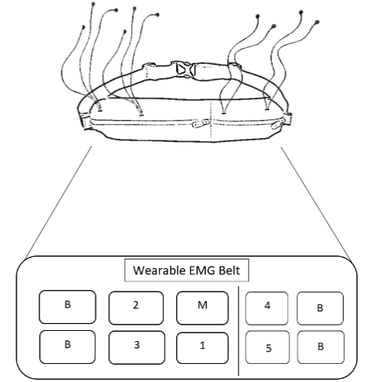
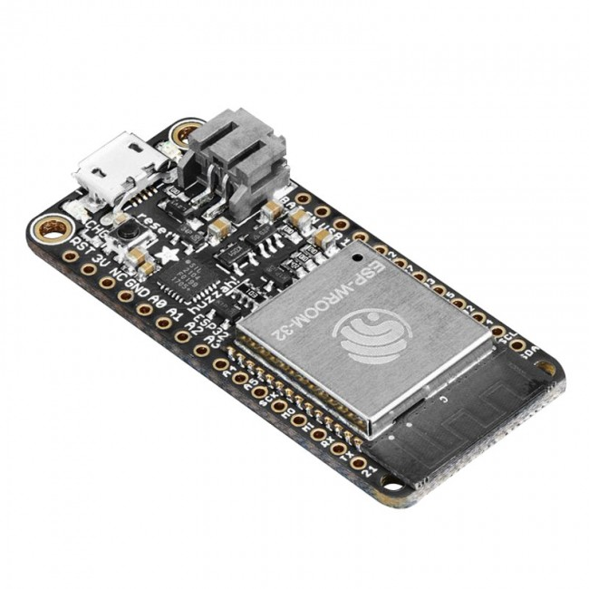
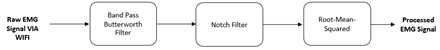
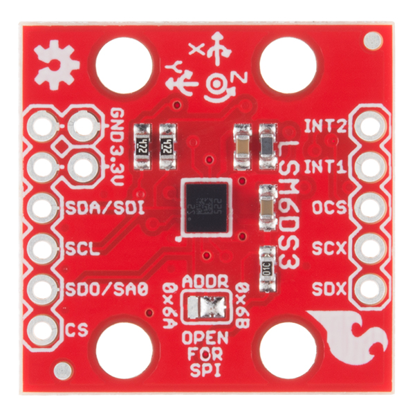

# Wearable Acquisiton Belt
Code for the Wearable Belt Microcontroller (ESP32) - To use with VIRTUAL REALITY TRUNK MUSCLE TRAINING SYSTEM Biomedical Capstone Project

## Table of Contents
[Purpose](#purpose)
<a name="purpose"/>  
[Microcontroller](#adafruit-esp32-huzzah-microcontroller)
<a name="adafruit-esp32-huzzah-microcontroller"/>  
[EMG Circuit(s)](#emg-circuits)
<a name="emg-circuits"/>  
[EMG Signal Transfer](#emg-signal-transfer)
<a name="emg-signal-transfer"/>  
[Intertial Measurement Unit (IMU)](#inertial-measurement-unit-imu)
<a name="inertial-measurement-unit-imu"/>  
[IMU Processing](#imu-processing)
<a name="imu-processing"/>  

## Associated Repositories
[1. Virtual Reality Software Code](https://github.com/GxRay/Trunk-Rehabilitation-VR-Training-Simulator-/tree/testEnv)  
[2. SpaceBall Code](https://github.com/bharath1000/VR_Simulator-Spaceball) 
[3. MagdwickAHRS algorithm](https://github.com/arduino-libraries/MadgwickAHRS) 

## Purpose
The patient will have a wearable EMG belt placed on their bodies to obtain the EMG/Positional data of the targeted muscles mentioned above. The Belt will consist of 2 pouches each housing a certain number of circuits and batteries that will be placed in circuit covers that will be mentioned later. Referring to Figure below the first pouch will contain 2 batteries to power the circuits (B in the figure) and 3 circuits (Numbers 1-3).  This pouch will also house the microcontroller that will send the data wirelessly to a device (M in the figure). The second pouch will house 2 more batteries and the remaining 2 circuits totalling to 5 circuits all together. Each circuit will have electrodes attached to wires protruding from the pouches to be attached to the patient

## Adafruit ESP32 Huzzah Microcontroller

The Adafruit HUZZAH32- ESP32 Feather Board has 32 I/O pins that provide more than the necessary amount for this device application. 18 of those pins are connected to the on-board ADCs, and meet the 5 required for our EMG sensor circuit. The board contains 2 SAR ADCs (successive approximation register ADCs) with 12-bit resolution, and 5 MHz max sample rate across the pins. This ensures the ADC sample rate will not result in aliasing, as the max sample rate is very high.

Both Bluetooth and 2.4 GHz WiFi wireless are available for wireless data transmission with this board. WiFi supports 801.11 N, which can reach up to 150 Mbps speeds, almost 10 times the speed of Bluetooth, and will be able to send data at a rate suitable for real-time biofeedback, at a longer range, and without the use of serial UART communication. It also supports WiFi Direct, which connects directly to other WiFi enabled devices for easier and faster communication.

## EMG Circuit(s)

In order to assess the muscle activity of the trunk, it is important to acquire relevant data from the appropriate muscle groups. Electromyography (EMG) is used to obtain electrical activity produced by skeletal muscles, more specifically the muscle cells they are comprised of. This is done using electrodes which will feed directly into a sensor circuit which will amplify and filter the signal. The resultant signal is then sent to an Analog-to-digital (ADC) converter for further signal processing. An overview indicating all the steps the signal will be sent through is shown below through circuit schematic.

## EMG Signal Transfer
EMG signal post processing was performed using C# libraries specially created for Unity based infinite impulse response real-time filtering and will operate using the processor on the phone that runs the virtual reality app. The link to the open source libraries can be found in the associated repositories. TCP/IP libraries in Unity and C# will be used to read data sent over the WiFi network connection from the microprocessor. TCP governs the transmission of data packets and is not a serial communication protocol, so it does not require setting UART and baud rate, making it very simple for data transmission.The Adafruit Huzzah ESP32 board collects the EMG data and sends it over WIFI through TCP/IP communication as a comma seperated string where unity parses and displays it accordingly.

## Inertial Measurement Unit (IMU)

Accelerometers are sensors that measure changes in both static and dynamic acceleration in relation to gravity on each axis dimension, and thus can provide both tilt angle and tilt velocity of the trunk. This positional data is used to measure medial-lateral (ML) and anterior-posterior (AP) movement of the patient’s trunk during training. However, a patient may also rotate their trunk instead of tilting, avoiding the desired movements for training. Gyroscopes measure angular velocity and change in angular velocity in relation to a resonating mass connected to a resistor, and can provide the rotational position of the trunk (roll, pitch, yaw). The Sparkfun LSM6DS3 Digital accelerometer and gyroscope combines both an accelerometer and a gyroscope for both tilt and rotational detection. It provides measurements in 6 degrees of freedom (3 linear, 3 rotational), and comes in a small form factor suitable for wearable devices. This board and sensor already include an ADC and combined Low-Pass and High-Pass Filters for the gyroscope, and a combined Low-Pass and Composite LP/HP circuit for the accelerometer, thus no additional preprocessing circuit is required, and the device output can be used directly by the microprocessor. It can read data up to 1.7 kHz, has an 8 kB memory buffer for data reading, and only consumes 0.9 mA in a low power state. This makes it an all-in-one solution to measure positional data efficiently and accurately in a wearable device application.

### IMU Processing
In order to obtain the positional data in the form of degrees rotation usable by the Unity VR framework, signal processing was done on the raw Accel and Gyro values obtained from the IMU in Arduino. A Madgwick filter, which combines angular velocities and accelerations from an IMU and turns them into an orientation, was used to calculate the degree rotation the user has moved

